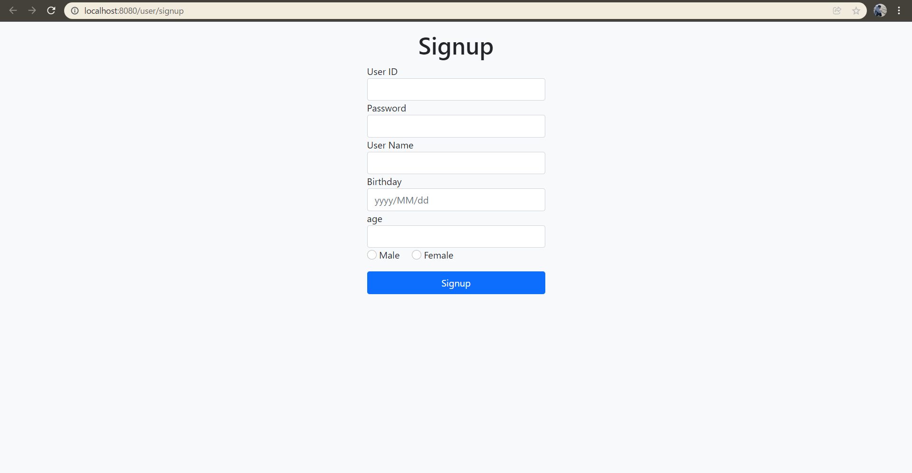
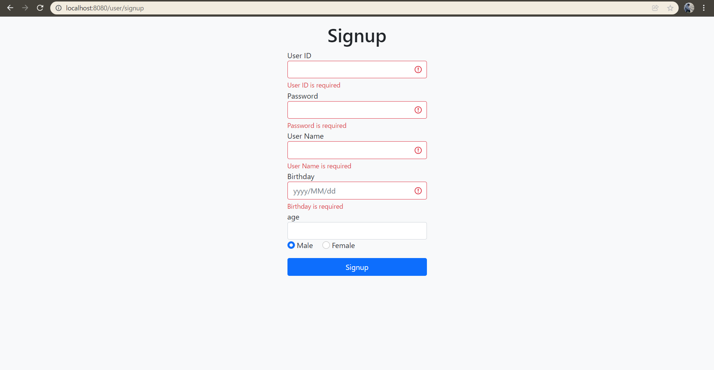
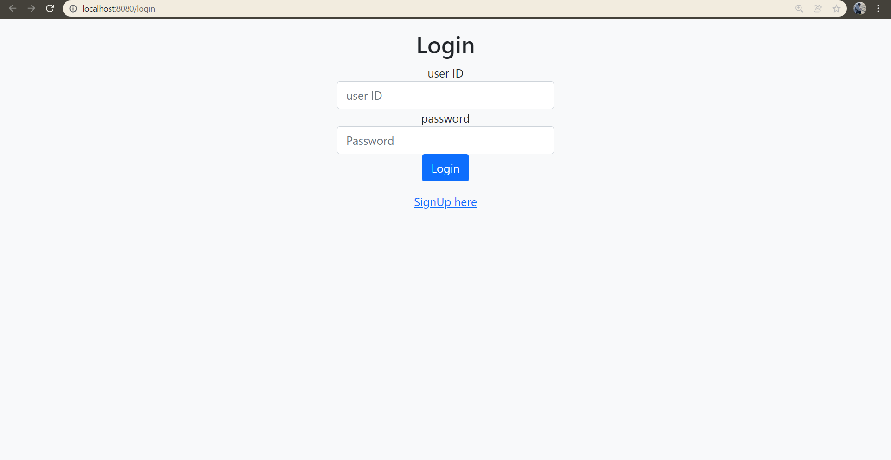
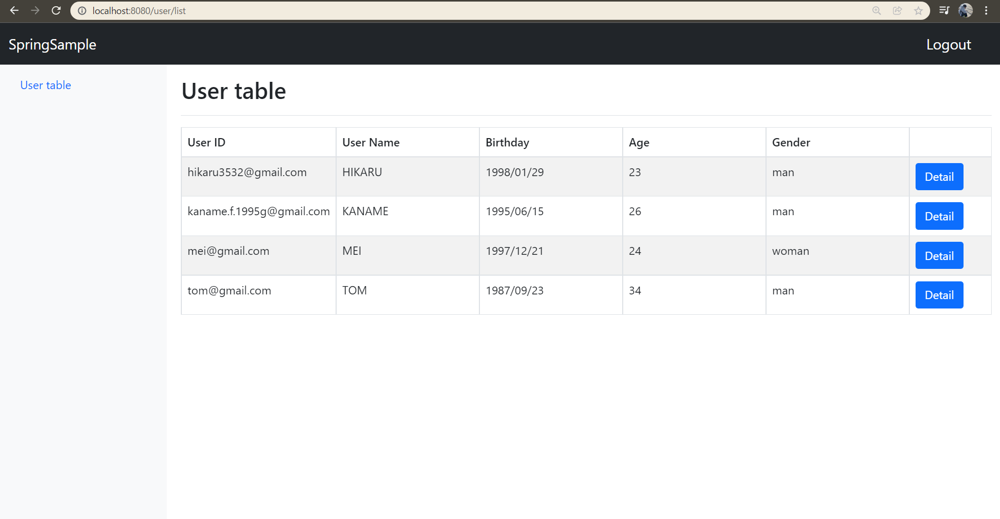
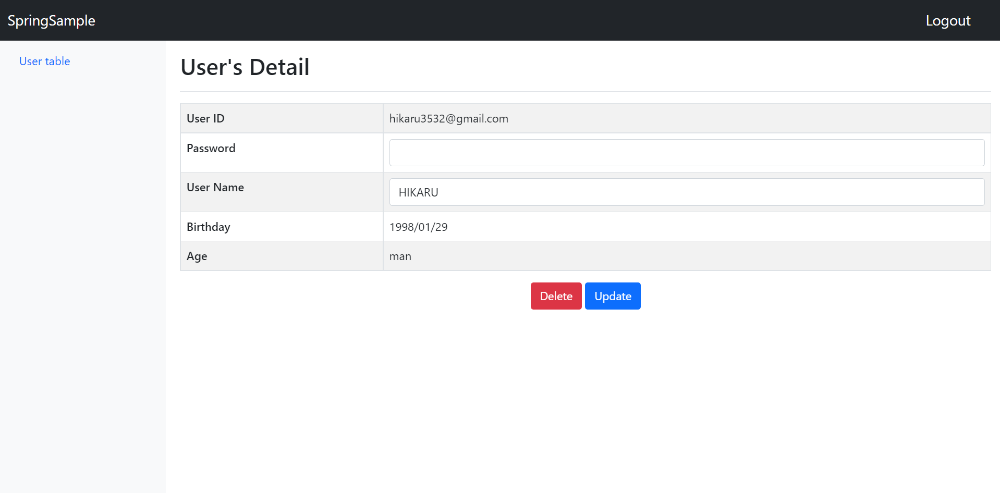

# Member Management Application

*********************
Member Management Appplication
*********************

## STACK etc (main)  
・Java  
・SpringBoot  
・Tymeleaf  
・html, CSS  
・BootStrap  
・MyBatis  

Database  
・MySQL  

Build tool  
・gradle  

## URL  
・Signup page  
http://localhost:8080/user/signup

・Login page  

sample:  
ID : kaname.f.1995g@gmail.com  
pass : Kaname8206

・Main page  
http://localhost:8080/user/list#

# Overview
・I developed a web application using JAVA SpringBoot. It is possible to manage the members belonging to the organization.

・Implemented user registration, login, display of list on screen, update of personal information, etc.

・The data stored in MYSQL was mapped and the data was linked by using MyBatis.

## Signup
 Register the user. To register a user, you need to enter the user ID, password, user name, birthday, age, and gender.  
As for gender, enter the form and use the selection form instead of the form.

 Press the Signup button to move to the login page.
 

### -Validation
When registering as a user, if an input that does not meet the specified rules is detected, a warning will be issued without page transition. Specifically, if you do not follow the form below, a warning will be issued.

・User ID ------- email form

・password ------ with 4 digits or more and 100 digits or less

・birthday ------ YYYY/MM/dd form

 If you have not entered each item, you will be warned that you must enter it.

In addition, validation has a two-step check, and if the above rule is not satisfied even if the input is completed, the page transition will not be performed.

## Login
  The login screen requires you to enter your user ID and password. If the input is correct, press the Login button to move to the user list screen where you can check the registered users. 
 Press Signup at the bottom of the login button to move to the Signup screen.

## User Table
  You can check the list of registered users on the user table page.  
Extract data from MYSQL database. Map the data by using MyBatis.
The mapped data is linked on the xml file.  
 A sense of unity is created by using Bootstrap for the page layout. A User Table link is set up on the left side of the page. You can always transition to this page.  
 A logout button is installed in the upper right part of the page. You can log out of the system by pressing it.  

  By pressing the detail button on the right side of the user list, you can move to the detail screen of each user.

## User's Detail
Display the details of the selected user. The password is hidden from the viewpoint of security.
You can update the user name and delete the user information on this screen.  
This is possible by pressing each button at the bottom.

